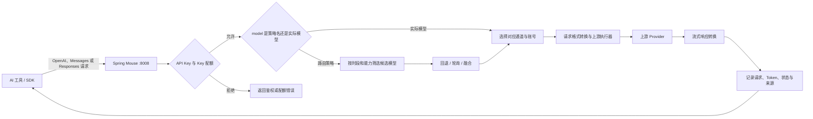
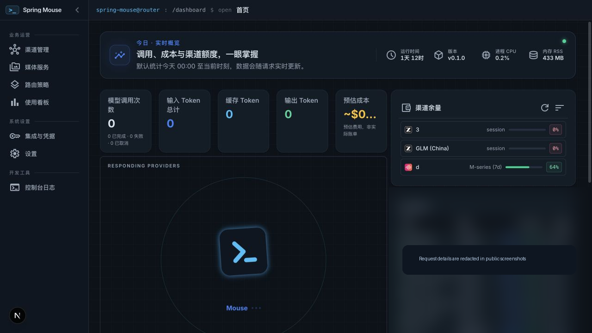
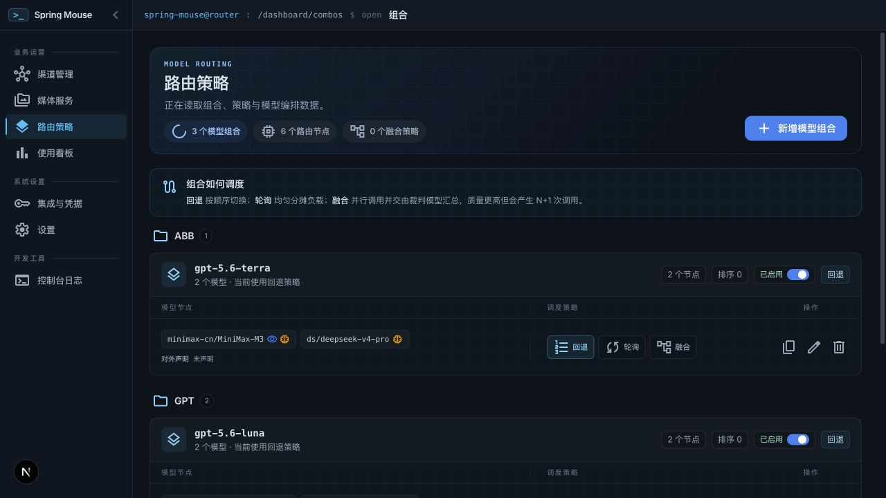
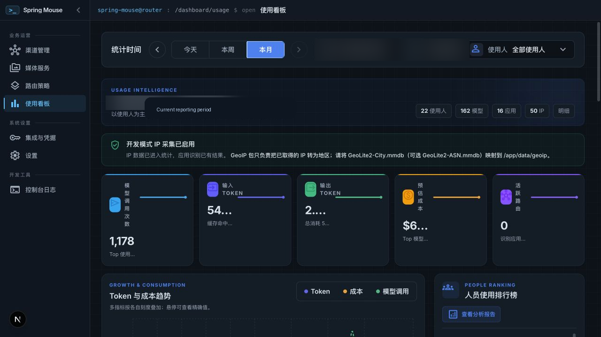
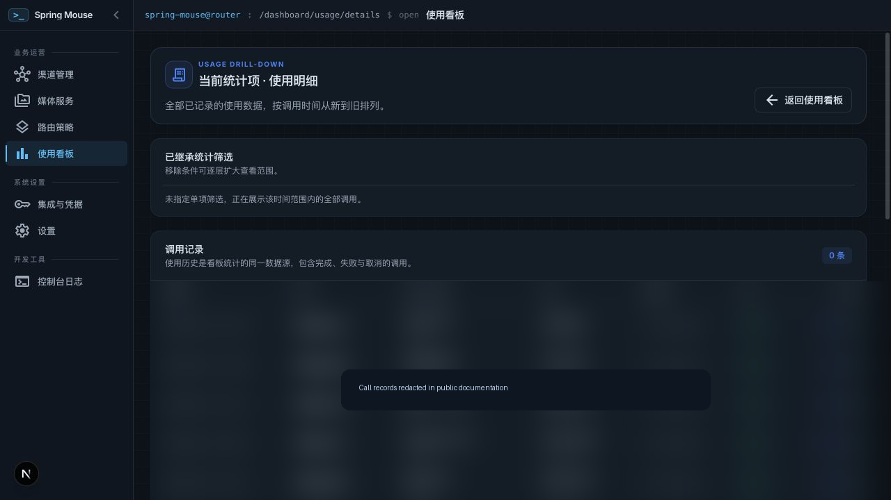
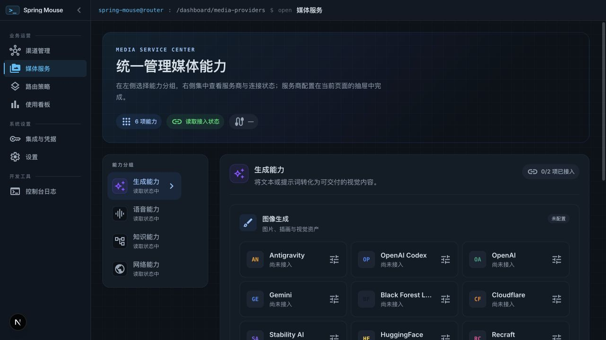

<div align="center">

# 🐭 Spring Mouse

**面向团队与开发者的 AI 路由网关、通道治理与用量控制台**

Spring Mouse 将多种 AI 工具和上游模型服务统一接入一个本地或私有部署的网关。它提供 OpenAI、Anthropic Messages 与 OpenAI Responses 等兼容接口，并把“通道、模型、路由策略、API Key、配额和用量”放到同一个控制台中管理。

[](LICENSE)
[](#运行要求)
[](#运行方式)

</div>

---

## 目录

- [它解决什么问题](#它解决什么问题)
- [核心概念](#核心概念)
- [请求如何被处理](#请求如何被处理)
- [路由策略](#路由策略)
- [已实现能力](#已实现能力)
- [控制台模块](#控制台模块)
- [接口兼容性](#接口兼容性)
- [快速开始](#快速开始)
- [接入 AI 工具或 SDK](#接入-ai-工具或-sdk)
- [安全与运维要点](#安全与运维要点)
- [运行方式](#运行方式)
- [项目结构](#项目结构)
- [文档与致谢](#文档与致谢)

---

## 它解决什么问题

当团队同时使用 Claude Code、Codex、Cursor、Cline、OpenClaw、各类 SDK 或内部应用时，常见问题是：

- 每个客户端都要维护不同 Provider 的地址、密钥和模型名；
- 同一 Provider 有多个账号，却无法统一安排优先级、轮询和失败切换；
- 单一模型不支持图片、音频、PDF 或视频输入时，请求只能失败；
- 模型配额、API Key 配额、使用人员和请求来源不可见；
- 模型切换、上游故障和流式协议差异需要在每个客户端分别处理；
- 私有部署时，外部访问、真实客户端 IP、请求日志和管理员权限缺少统一边界。

Spring Mouse 把这些问题收敛在网关层：客户端只需要配置一个 Endpoint；管理员通过控制台维护通道、模型和**路由策略**；网关在运行时完成认证、模型选择、账号选择、格式转换、流式转发、失败切换与用量记录。

---

## 核心概念

| 概念 | 含义 | 作用 |
|---|---|---|
| **通道** | 一个上游服务及其连接配置，例如 OAuth 登录、PAT、API Key 或兼容节点。 | 管理可用账号、连接状态、模型和上游配额。 |
| **模型** | 通道下可调用的实际模型，以 `provider/model` 形式标识。 | 既可以直接作为客户端请求的 `model`，也可以被路由策略引用。 |
| **路由策略** | 有名称的一组候选模型及其执行规则。 | 客户端用策略名称请求；策略决定请求如何分配给候选模型。 |
| **API Key** | Spring Mouse 为调用方签发的访问凭证。 | 识别调用方、控制接口访问、统计用量并应用 Key 配额。 |
| **能力兜底池** | 为视觉、PDF、音频输入、视频输入配置的备用模型池。 | 请求需要的能力不被策略原候选模型覆盖时，补充具备该能力的候选模型。 |
| **用量记录** | 请求的端点、通道、模型、调用方、Token、状态和可选明细。 | 支撑 Dashboard、配额判断、人员/来源分析与问题排查。 |

---

## 请求如何被处理



处理顺序如下：

1. **识别调用方**：读取 Bearer API Key；当启用 API Key 强制校验时，无效请求会被拒绝。
2. **检查 Key 额度**：如果该 Key 使用“受限配额”模式，网关分别检查 5 小时与近 7 天两个窗口。
3. **解析 `model`**：请求可以直接指定 `provider/model`，也可以指定一个路由策略名称。
4. **选择候选模型**：策略会先根据单模型生效/失效时段筛选；如请求含图像、PDF、音频或视频输入，能力兜底池可补充候选模型。
5. **执行策略**：按照回退、轮询或融合规则发起调用。
6. **选择通道账号**：同一 Provider 的多个连接可按优先级填充或按轮询分摊；限流、认证失败或模型锁定的账号会被暂时排除。
7. **协议翻译与流式转发**：按客户端请求格式和上游格式转换请求、工具调用与 SSE/JSON 响应。
8. **记录可观测数据**：记录模型、通道、调用方、来源、状态、Token 和可选请求明细；Dashboard 通过 SSE 刷新实时统计。

---

## 路由策略

路由策略是 Spring Mouse 的主要路由配置单元。它不是新的模型类型，而是一个稳定的、可在客户端 `model` 字段中直接使用的策略名称。

### 策略组成

每条路由策略包含：

- **策略名称**：只能使用字母、数字、点、下划线和连字符；客户端直接把它填入 `model`。
- **候选模型列表**：按策略需要排列的多个 `provider/model`。
- **单模型时段**：可给每个候选模型配置时区、生效时段和失效时段。
- **执行方式**：回退、轮询或融合。
- **执行参数**：轮询的连续次数；融合模式下可指定裁判模型和融合调优参数。

### 三种执行方式

| 方式 | 运行逻辑 | 适用场景 |
|---|---|---|
| **回退** | 按候选顺序调用；当前模型失败、不可用或不满足条件时尝试下一个。 | 成本优先、稳定性优先的默认策略。 |
| **轮询** | 在候选模型之间轮换分配请求；可设置每个模型连续接收的请求数。 | 多账号/多模型分摊负载，避免单一通道过快耗尽。 |
| **融合** | 并行请求策略内多个面板模型，再由裁判模型综合结果。 | 对质量要求高且可接受多次上游调用成本的任务。 |

> 融合策略通常会产生“面板模型数量 + 1”的上游调用量；裁判模型未指定时，系统会从当前可用模型中选择。

### 时段与组合能力声明

- 一个候选模型可设置多个**生效时段**和**失效时段**，时区取自该策略配置。
- 没有配置生效时段的候选模型默认可全天参与路由。
- 每个组合可对外声明**上下文窗口**（控制台以 K tokens 填写）、**视觉输入**和**音频输入**能力；这些声明会显示在公开模型列表中。
- 声明视觉或音频时，组合必须至少包含一个支持该能力的节点。带对应输入的请求只会在这些兼容节点中路由和回退，不会跳到其他组合的全局兜底模型。

### 示例

假设创建策略 `coding-primary`：

```text
候选 1  cc/claude-sonnet-4-5   工作日 09:00–18:00 生效
候选 2  cx/gpt-5-codex         全天
候选 3  glm/glm-5              全天
执行方式  回退
```

客户端请求时：

```json
{
  "model": "coding-primary",
  "messages": [{ "role": "user", "content": "Review this patch" }],
  "stream": true
}
```

在工作时段，网关优先尝试候选 1；失败后依次尝试候选 2、候选 3。非工作时段则跳过候选 1。

---

## 已实现能力

### 统一模型网关

- OpenAI Chat Completions、Anthropic Messages、OpenAI Responses 三类主要对话接口。
- 模型列表与模型详情接口；支持模型别名、自定义模型、禁用模型和可用性测试。
- 文本嵌入、图像生成、视频生成/编辑/查询、语音合成、语音转写、音色列表、Web Search 与 Web Fetch 接口。
- 多种请求/响应格式与流式响应之间的转换，适配不同客户端和上游。

### 通道与账号治理

- Provider 连接管理：OAuth、PAT、API Key 及 OpenAI/Anthropic 兼容节点。
- 通道模型管理：查询、测试、启停模型、设置模型别名与自定义模型。
- 同一 Provider 多账号：按连接优先级填充，或按轮询分配；认证/限流/模型锁定后自动跳过不可用连接。
- 通道配额展示与手动刷新；Dashboard 支持配置关注的通道配额面板。

### 调用方与额度控制

- 创建、禁用、删除和命名 API Key。
- 支持决定是否强制所有兼容接口携带 API Key。
- API Key 可设置关闭、受限或不受限的额度模式。
- 受限 Key 分别统计 **5 小时** 与 **近 7 天** Token 窗口；窗口可定时滚动重置，也可在控制台手动重置。
- API Key、请求来源和用户代理会进入用量统计，便于区分不同调用方。

### 用量与运营分析

- 实时总览：服务状态、请求数、Token、成功率、通道配额与活跃路由拓扑。
- 维度分析：Provider、模型、调用方、来源、时间范围、请求详情和原始请求日志。
- SSE 实时推送用量变化，避免页面只依赖轮询。
- 人员分析报告：从活跃时长、调用频次、Token 规模、持续性和成功率等数据形成辅助观察；应与实际交付质量和业务贡献结合使用，不能单独作为绩效结论。

### Token 与请求处理工具

- RTK Token Saver：对请求内容进行压缩，降低冗余工具输出对上下文的占用。
- Headroom：可选外部服务，用于额外处理与压缩；支持在控制台检查连接、启停本地实例或使用外部地址。
- PxPipe：可选处理管道，可安装、启停、重启、查看运行状态、统计和日志。
- Translator：在控制台保存/加载翻译配置、发起翻译请求并查看翻译器日志。

### 媒体与网络能力

- 分开管理图像、语音、视频、嵌入、Web Search 和 Web Fetch 的 Provider。
- 支持各类 TTS Provider 的音色获取。
- 可接入自建 STT、TTS 和 Embedding 服务，以及 OpenAI/Anthropic 兼容上游节点。

### IDE 与远程访问

- MITM/DNS 工具：为受支持客户端拦截并重定向流量到 Spring Mouse；需要安装本地根证书并谨慎使用管理员权限。
- Cloudflare Tunnel：控制台中保存 Tunnel Token、启动/停止通道并查看公开地址。
- 上游代理：支持 HTTP、HTTPS、SOCKS 代理与 `NO_PROXY` 配置。

---


> 想查看当前实现的完整功能地图、Dashboard 模块、协议、运行与安全能力，请阅读 [功能全景](docs/FEATURES.md)。

## 控制台模块

Dashboard 默认运行在：

- 开发环境：`http://localhost:8007/dashboard`
- 生产/Docker：`http://localhost:8008/dashboard`

| 模块 | 主要职责 |
|---|---|
| **概览** | 服务状态、实时用量、路由拓扑、通道配额和运营概览。 |
| **通道管理** | Provider、认证连接、可用模型、通道配额和兼容节点。 |
| **路由策略** | 管理策略名称、候选模型、时段、回退/轮询/融合规则和能力兜底。 |
| **媒体服务** | 图像、音频、视频、嵌入、搜索和抓取服务配置。 |
| **Endpoint** | API Key、接口地址、Key 配额、访问控制和调用方配置。 |
| **用量分析** | 趋势图、排行、请求详情、人员/来源分析和实时流。 |
| **配额** | 聚合查看各通道/账号配额。 |
| **Token Saver** | RTK、Headroom、PxPipe 等请求处理能力。 |
| **翻译器 / 日志** | 翻译配置、控制台日志和调试信息。 |
| **个人与系统设置** | 管理员密码、数据库、代理、Cloudflare Tunnel、可观测性配置。 |
| **基础对话** | 在控制台直接测试已配置的模型或策略。 |

---


## 控制台截图

截图来自本地演示环境；请求明细已脱敏。

### 运营概览



### 模型路由策略



### 使用看板：趋势与成本分析



### 使用看板：调用明细钻取



### 媒体服务中心



## 接口兼容性

所有兼容接口以 `/v1` 为根路径。不同客户端根据自身协议选择其中一个端点；实际可调用的模型和媒体能力取决于已配置的通道。

| 类别 | 接口 |
|---|---|
| OpenAI 对话 | `POST /v1/chat/completions` |
| Anthropic Messages | `POST /v1/messages` |
| OpenAI Responses | `POST /v1/responses` |
| Token 计数 | `POST /v1/messages/count_tokens` |
| 模型 | `GET /v1/models`、`GET /v1/models/info`、`GET /v1/models/:kind` |
| 嵌入 | `POST /v1/embeddings` |
| 图像 | `POST /v1/images/generations` |
| 视频 | `POST /v1/videos/generations`、`POST /v1/videos/edits`、`GET /v1/videos/:id` |
| 语音 | `POST /v1/audio/speech`、`POST /v1/audio/transcriptions`、`GET /v1/audio/voices` |
| 网络 | `POST /v1/search`、`POST /v1/web/fetch` |

示例：

```bash
curl http://localhost:8008/v1/chat/completions \
  -H "Authorization: Bearer <SPRING_MOUSE_API_KEY>" \
  -H "Content-Type: application/json" \
  -d '{
    "model": "coding-primary",
    "messages": [{"role": "user", "content": "解释这段代码的风险"}],
    "stream": true
  }'
```

---

## 快速开始

### 运行要求

- Node.js **22.5 或更高版本**（优先使用内置 `node:sqlite`）
- npm
- Docker / Docker Compose（可选，用于容器部署）

### 本地开发

```bash
git clone https://github.com/choarkinphe/spring-mouse.git
cd spring-mouse

npm install
cp .env.example .env
```

编辑 `.env`，至少替换以下安全项：

```dotenv
JWT_SECRET=请替换为长随机字符串
INITIAL_PASSWORD=请设置管理员初始密码
API_KEY_SECRET=请替换为稳定的长随机字符串
MACHINE_ID_SALT=请替换为稳定的长随机字符串
```

启动开发服务器：

```bash
npm run dev
```

访问：

- Dashboard：`http://localhost:8007/dashboard`
- API：`http://localhost:8007/v1`

### 本地生产构建

```bash
npm run build
npm run start
```

访问：

- Dashboard：`http://localhost:8008/dashboard`
- API：`http://localhost:8008/v1`

完整的 Docker、Compose、Nginx、Jenkins 和安全部署说明见 [DEPLOY.md](DEPLOY.md)。

---

## 接入 AI 工具或 SDK

通用配置如下：

```text
Base URL: http://<host>:8008/v1
API Key:  在 Dashboard → Endpoint 创建或复制
Model:    实际模型名 provider/model，或路由策略名称
```

例如，在支持 OpenAI 兼容配置的工具中：

```text
Base URL: http://127.0.0.1:8008/v1
API Key:  sk-...
Model:    coding-primary
```

使用策略名称的好处是：客户端不需要知道当前优先模型、账号切换、时段规则或能力兜底配置；这些由网关统一控制。

---

## 安全与运维要点

1. **生产环境必须替换 `.env` 中所有 `change-me` 值。** 特别是 `JWT_SECRET`、`API_KEY_SECRET` 和 `MACHINE_ID_SALT`；后两者投入使用后不要随意更换。
2. **默认启用 API Key 管控更安全。** 将 `REQUIRE_API_KEY` 设为 `true`，并为不同系统或人员发放不同 Key。
3. **反向代理必须显式配置 `TRUSTED_PROXY_IPS`。** Spring Mouse 只有在 TCP 对端被信任时才接受 `X-Real-IP` / `X-Forwarded-For`。
4. **使用 HTTPS 时设置 Cookie 安全标记。** 反向代理终止 TLS 后，应设置 `AUTH_COOKIE_SECURE=true`，同时把 `BASE_URL` 与 `NEXT_PUBLIC_BASE_URL` 改为公开 HTTPS 地址。
5. **请求明细属于敏感数据。** `ENABLE_REQUEST_LOG_FILE_DUMPS=true` 时会保存完整请求/响应副本；请按组织数据规范配置留存和访问权限。
6. **MITM 与公网 Tunnel 需最小权限。** 仅在明确场景启用，管理员应了解根证书、DNS 重定向和公网暴露的安全影响。

---

### Docker Hub 与 Compose 部署

发布镜像为 `choarkinphe/spring-mouse`。首次部署、Docker Hub 发布配置、版本固定、升级与回滚的完整步骤见 [Docker Hub 发布与 Docker Compose 部署](docs/DOCKERHUB.md)。

使用者的最短部署路径：

```bash
git clone https://github.com/choarkinphe/spring-mouse.git
cd spring-mouse
cp .env.example .env
# 编辑 .env，替换所有 change-me 值
docker compose pull
docker compose up -d
```

默认拉取 `choarkinphe/spring-mouse:latest`；生产环境可在 `.env` 中使用 `SPRING_MOUSE_IMAGE` 固定到已验证的版本标签。

### Google OAuth Provider 配置

为避免把 OAuth 凭据发布到开源仓库，Gemini 与 Antigravity provider 不再包含内置 Google OAuth client。若要使用这些 provider，请在 `.env` 中配置你自己的 Google OAuth client：

```dotenv
GEMINI_OAUTH_CLIENT_ID=your-google-oauth-client-id
GEMINI_OAUTH_CLIENT_SECRET=your-google-oauth-client-secret
ANTIGRAVITY_OAUTH_CLIENT_ID=your-google-oauth-client-id
ANTIGRAVITY_OAUTH_CLIENT_SECRET=your-google-oauth-client-secret
```

## 运行方式

| 场景 | 命令 | 端口 |
|---|---|---|
| 本地开发 | `npm run dev` | `8007` |
| 开发重启辅助 | `npm run dev:restart` | `8007` |
| 生产构建 | `npm run build && npm run start` | `8008` |
| Docker Compose | `docker compose up -d` | `8008` |

---

## 项目结构

```text
spring-mouse/
├── src/app/                 # Dashboard 页面、管理 API、/v1 兼容 API
├── src/sse/                 # 请求入口、认证、模型解析与用量衔接
├── open-sse/                # Provider 执行器、协议翻译、流处理、路由核心
├── src/lib/                 # SQLite、配额、日志、Tunnel、Headroom、PxPipe 等服务
├── src/mitm/                # MITM、证书与 DNS 重定向工具
├── cli/                     # CLI、托盘和启动逻辑
├── setup-cli/               # 外部 AI 工具配置辅助
├── skills/                  # Agent Skill 定义
├── tests/                   # Vitest 单元与集成测试
├── Dockerfile               # 多阶段生产镜像
├── docker-compose.yml       # Docker Hub 镜像的 Compose 模板
├── Jenkinsfile              # 构建、推送、部署与版本核验流程
├── DEPLOY.md                # 部署说明
└── docs/ARCHITECTURE.md     # 技术架构说明
```

---

## 文档与致谢

- [部署文档](DEPLOY.md)
- [架构文档](docs/ARCHITECTURE.md)
- [Docker 快速参考](DOCKER.md)
- [Docker Hub 发布与 Compose 部署](docs/DOCKERHUB.md)
- [功能全景](docs/FEATURES.md)

Spring Mouse 的产品形态受到 [9Router](https://github.com/decolua/9router) 的启发。感谢其在 AI 路由、Token 节省和多 Provider 接入方面提供的思路；Spring Mouse 以自身的通道治理、路由策略、调用方配额和运营分析需求继续演进。

同时感谢：

- [CLIProxyAPI](https://github.com/router-for-me/CLIProxyAPI)
- [RTK](https://github.com/rtk-ai/rtk)
- [Caveman](https://github.com/JuliusBrussee/caveman)
- [Ponytail](https://github.com/DietrichGebert/ponytail)

## 许可

MIT License，详见 [LICENSE](LICENSE)。
