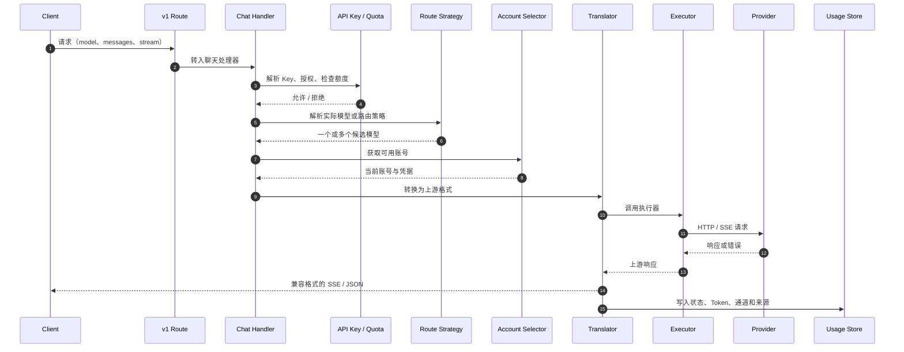

# Spring Mouse 技术架构

> 本文档描述当前仓库的实际运行结构。对外产品术语统一为 **通道、模型、路由策略、API Key 和用量**；部分底层文件、数据库表或历史 API 路径仍保留早期命名，仅用于兼容，不应作为新的产品概念使用。

---

## 1. 架构目标

Spring Mouse 是部署在本地、内网或私有服务器中的 AI 网关。它的职责不是训练或托管模型，而是：

1. 向 AI 工具、SDK 和内部系统提供统一的兼容 API；
2. 管理多个上游 Provider、兼容节点和多个账号连接；
3. 通过路由策略把一个稳定入口映射到多个候选模型；
4. 在模型/账号不可用时进行有边界的切换；
5. 对请求、Token、配额、调用方和来源进行记录与分析；
6. 提供管理控制台、MITM/DNS 工具、Token 处理工具和私有部署能力。

---

## 2. 系统上下文

```mermaid
flowchart LR
  subgraph Clients[调用侧]
    CC[Claude Code / Codex / Cursor / Cline 等]
    SDK[OpenAI 或 Anthropic SDK]
    APP[内部应用]
    WEB[管理员浏览器]
  end

  subgraph SpringMouse[Spring Mouse]
    V1[/v1 兼容 API]
    MGMT[/api 管理 API]
    DASH[Dashboard]
    ROUTER[路由与协议转换核心]
    AUTH[API Key / 管理员认证]
    DB[(SQLite)]
    OBS[用量与请求明细]
  end

  subgraph Upstream[上游]
    OAUTH[OAuth / PAT 通道]
    KEY[API Key 通道]
    NODE[OpenAI / Anthropic 兼容节点]
    MEDIA[图像、语音、视频、嵌入、搜索服务]
  end

  CC --> V1
  SDK --> V1
  APP --> V1
  WEB --> DASH
  DASH --> MGMT
  V1 --> AUTH
  MGMT --> AUTH
  AUTH --> ROUTER
  ROUTER --> OAUTH
  ROUTER --> KEY
  ROUTER --> NODE
  ROUTER --> MEDIA
  ROUTER --> DB
  ROUTER --> OBS
  MGMT --> DB
  OBS --> DB
```

---

## 3. 运行进程与端口

| 模式 | 入口 | 默认端口 | 说明 |
|---|---|---:|---|
| 开发 | `npm run dev` | 8007 | Next.js 开发服务器。 |
| 生产 | `npm run build && npm run start` | 8008 | `custom-server.js` 包装 Next standalone 服务。 |
| Docker | `node custom-server.js` | 8008 | 镜像入口，数据目录为 `/app/data`。 |

生产入口 `custom-server.js` 负责：

- 对可信反向代理处理真实客户端 IP；
- 删除调用方伪造的转发头；
- 给内部请求附加进程级校验标记；
- 启动后台 Token 刷新调度；
- 承载 Next.js 生产服务。

因此生产环境应使用 `npm run start`，而不是直接运行 `next start`。

---

## 4. 分层结构

```text
src/app/
  (dashboard)/dashboard/    Dashboard 页面
  api/                      管理 API、认证、用量、设置、Tunnel、PxPipe 等
  api/v1/                   OpenAI / Messages / Responses / 媒体兼容 API

src/sse/
  handlers/                 /v1 请求入口（聊天、搜索、图片、语音等）
  services/                 API Key、模型解析、Token 刷新、日志等连接层服务

open-sse/
  executors/                各 Provider 的请求执行器
  translator/               请求/响应格式转换
  providers/                Provider 注册表、能力表、定价和模型定义
  services/                 路由、账号切换、容量适配、流处理等核心服务
  rtk/                      Token Saver 实现

src/lib/
  db/                       SQLite 驱动、Schema、仓储、迁移与备份
  tunnel/                   Cloudflare Tunnel 管理
  headroom/                 Headroom 检测与控制
  pxpipe/                   PxPipe 安装、加载、日志与状态
  usage/                    用量、统计与请求详情

src/mitm/
  证书、DNS 重定向、MITM 代理与受支持客户端流量拦截
```

---

## 5. 兼容 API 层

### 5.1 `/v1` 路由

`src/app/api/v1/*` 对外提供以下类别的接口：

- 对话：`chat/completions`、`messages`、`responses`；
- 模型：模型列表、类别与详情；
- 嵌入：`embeddings`；
- 媒体：图像生成、视频生成/编辑/查询、TTS、STT、音色；
- 网络：搜索和 Web Fetch；
- 计数：Messages Token 计数；
- 部分客户端所需的 beta 模型路由。

客户端协议与上游协议不需要一致。请求进入后由 `src/sse/handlers/*` 和 `open-sse/translator/*` 共同完成识别、转换与响应归一化。

### 5.2 管理 API

`src/app/api/*` 是 Dashboard 和运维能力的后端，主要域包括：

| 域 | 说明 |
|---|---|
| `auth` | 管理员登录、退出、密码重置与状态。 |
| `providers` / `provider-nodes` | 通道、认证连接、兼容节点、模型测试与校验。 |
| `oauth` | Codex、Cursor、GitLab、Kiro、iFlow 等认证流程。 |
| `keys` | API Key 创建、查询、更新、删除和额度状态。 |
| `models` | 模型别名、自定义模型、禁用模型、可用性与测试。 |
| 路由策略管理 API | 创建、更新、删除策略及候选模型列表。 |
| `usage` | 统计、历史、日志、请求详情、实时 SSE。 |
| `settings` | 登录要求、数据库、代理测试与运行设置。 |
| `headroom` / `pxpipe` | Token 与请求处理工具的状态和控制。 |
| `tunnel` | Cloudflare Tunnel 启停与状态。 |

---

## 6. 请求生命周期

以 `POST /v1/chat/completions` 为例：



### 6.1 API Key 和 Key 配额

请求会解析 `Authorization: Bearer <key>`。系统根据当前设置决定是否必须携带 Key；Key 的使用模式包括：

- `off`：不应用 Key 配额；
- `unlimited`：识别调用方但不做窗口限额；
- `limited`：应用统一的 5 小时与近 7 天 Token 上限。

配额的窗口起点由每个 Key 的下次重置时间维护；请求成功记录进入 `usageHistory` 后，会被用于计算窗口累计 Token。

### 6.2 路由策略解析

如果 `model` 是实际模型，网关直接走通道选择。若 `model` 是路由策略名称：

1. 读取策略候选模型；
2. 根据每个候选模型的生效/失效时段过滤；
3. 根据请求内容检测视觉、PDF、音频输入和视频输入能力；
4. 在原候选模型都无法满足能力时，从配置的能力兜底池补充候选；
5. 按策略的回退、轮询或融合方式执行。

### 6.3 通道账号选择

Provider 内部可有多个已认证连接。`src/sse/services/auth.js` 根据：

- 连接启用状态；
- 模型锁定/冷却状态；
- 当前请求排除列表；
- 通道优先级；
- Provider 的 `fill-first` 或 `round-robin` 分配规则；

选择账号。上游返回认证失败、限流或不可用状态后，当前连接会进入排除或冷却逻辑，并尝试其他可用连接或返回不可用错误。

---

## 7. 路由策略执行器

路由执行核心集中处理多候选模型的执行、失败切换与轮换状态。

### 回退

按候选顺序尝试。失败是否继续由错误状态、上游返回和可用性决定。该模式适合保证优先通道优先使用，同时提供后备路径。

### 轮询

系统按策略名保存轮换状态，在候选模型之间按序分配请求。可配置每个模型连续接收的请求数量，用于在上下文连续性与负载均衡之间折中。

### 融合

系统并行请求多个候选模型，把成功回答作为面板结果，再调用裁判模型生成统一响应。融合执行器会：

- 处理单个面板失败；
- 当只有一个面板成功时直接返回该回答；
- 当所有面板失败时返回明确错误；
- 对面板调用移除不适合并行综合的工具相关字段；
- 记录面板和裁判调用产生的额外消耗。

---

## 8. 协议翻译与 Provider 执行

`open-sse/translator/` 含请求与响应转换器，覆盖 OpenAI、Claude、Gemini、Kiro、Cursor、Ollama、Vertex、CommandCode 等格式组合。

`open-sse/executors/` 为不同上游实现请求构造、认证头、SSE 读取、错误映射和特殊客户端行为。Provider 注册表位于 `open-sse/providers/registry/`，同时提供模型能力、定价和思考级别等元数据。

设计原则：

- 客户端请求格式由入口识别，而不是要求调用方预先转换；
- 上游执行器只处理自身 Provider 的细节；
- 翻译器将上游响应规范化回客户端期待的格式；
- Token、错误、连接 ID 和可观测字段在统一层汇集。

---

## 9. 数据与持久化

### 9.1 SQLite

应用数据由 `src/lib/db/` 管理。驱动优先级：

1. Bun：`bun:sqlite`；
2. Node.js 22.5+：`node:sqlite`；
3. 回退：`sql.js`。

数据文件路径由 `DATA_DIR` 决定；Docker 默认使用 `/app/data`。实际 SQLite 文件由 `src/lib/db/paths.js` 管理，默认位于数据目录下的 `db/data.sqlite`。

主要实体包含：

- Provider 连接与兼容节点；
- 模型别名、禁用/自定义模型；
- 路由策略及候选模型；
- API Key 与额度状态；
- Settings；
- 用量历史、日聚合、请求详情；
- 数据库迁移与备份元数据。

### 9.2 用量与请求明细

`usageHistory` 记录成功/失败状态、模型、Provider、连接、API Key、请求端点、Token、成本和时间字段。`requestDetails` 保存可选的详细请求/响应数据，用于 Dashboard 的请求详情页。

由于请求明细可能包含敏感上下文，是否记录、保留多久以及谁能访问应由部署者负责。

---

## 10. Dashboard 与实时更新

Dashboard 是 Next.js 页面，主要模块包括：

- 概览与用量总览；
- 通道管理；
- 路由策略；
- Endpoint / API Key；
- 媒体服务；
- 配额；
- Token Saver；
- PxPipe；
- 翻译器和日志；
- 个人与系统设置。

`/api/usage/stream` 提供 Server-Sent Events。Dashboard 在首屏只加载最低成本的服务状态，其他用量模块在客户端按需加载并接受实时更新，避免大量统计请求影响网关处理。

人员分析功能使用请求频次、Token、活跃时长、连续性与成功率等指标生成观察报告。它是运营辅助信息，不替代对交付质量、岗位职责和协作贡献的判断。

---

## 11. 安全边界

| 边界 | 实现 |
|---|---|
| Dashboard 管理员 | 登录 Cookie、密码重置和会话管理。 |
| API 调用方 | API Key 校验与可选强制要求。 |
| Key 消耗控制 | 5 小时 / 近 7 天额度窗口。 |
| 真实客户端 IP | `custom-server.js` 仅信任 `TRUSTED_PROXY_IPS` 中的 TCP 对端。 |
| 请求详情 | 路由中对敏感头部和 payload 做脱敏；部署者仍需限制访问。 |
| 上游凭据 | 保存在本地数据存储，由 Provider 连接配置使用。 |
| MITM | 根证书、DNS 重定向和本地代理属于高权限能力，需要单独启用。 |
| 公网 Tunnel | Cloudflare Token 与 Dashboard 管理能力应限制给管理员。 |

---

## 12. 可选运行组件

### Headroom

外部请求处理服务。应用通过 `HEADROOM_URL` 检测和调用；可作为 Docker Compose sidecar 或独立服务运行。

### PxPipe

可安装的处理管道。应用提供安装、加载、启停、统计和日志 API，是否启用由 Settings 决定。

### MITM / DNS 工具

`src/mitm/` 提供证书安装、DNS 定向与代理。设计用于受支持客户端的流量接入，不是所有客户端接入 Spring Mouse 的必要条件。

### Cloudflare Tunnel

镜像包含 `cloudflared`。系统保存 Tunnel 相关状态并通过管理 API 启停；公开访问仍应配合登录、API Key 和 HTTPS 策略。

---

## 13. 开发与验证

```bash
# 开发
npm install
npm run dev

# 构建
npm run build

# 生产启动
npm run start

# 测试（测试包独立）
cd tests
npm test
```

建议改动路由相关代码时至少验证：

1. 直接模型请求；
2. 路由策略的回退与轮询；
3. 融合策略及裁判模型；
4. 多账号限流后的账号切换；
5. API Key 限额窗口；
6. OpenAI / Messages / Responses 三种入口的流式响应；
7. Dashboard 的用量 SSE 更新。

---

## 14. 相关文档

- [项目说明](../README.md)
- [部署指南](../DEPLOY.md)
- [Docker 快速参考](../DOCKER.md)
