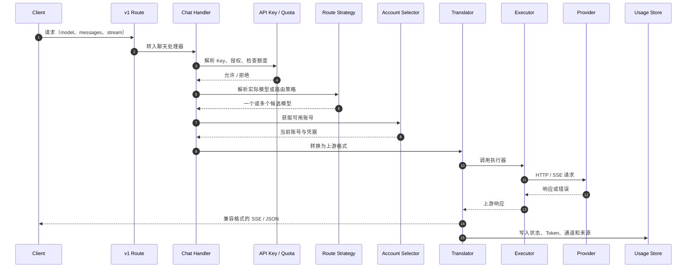

# Spring Mouse 技术架构

> 本文档描述当前仓库的实际运行结构。对外产品术语统一为 **通道、模型、路由策略、API Key 和用量**；部分底层文件、数据库表或历史 API 路径仍保留早期命名，仅用于兼容，不应作为新的产品概念使用。

---

## 1. 架构目标

Spring Mouse 是部署在本地、内网或私有服务器中的 AI 网关。它的职责不是训练或托管模型，而是：

1. 向 AI 工具、SDK 和内部系统提供统一的兼容 API；
2. 管理多个上游 Provider、兼容节点和多个账号连接；
3. 通过路由策略把一个稳定入口映射到多个候选模型；
4. 在模型/账号不可用时进行有边界的切换；
5. 对请求、Token、配额、调用方和来源进行记录与分析；
6. 提供管理控制台、MITM/DNS 工具、Token 处理工具和私有部署能力。

---

## 2. 系统上下文

```mermaid
flowchart LR
  subgraph Clients[调用侧]
    CC[Claude Code / Codex / Cursor / Cline 等]
    SDK[OpenAI 或 Anthropic SDK]
    APP[内部应用]
    WEB[管理员浏览器]
  end

  subgraph SpringMouse[Spring Mouse]
    V1[/v1 兼容 API]
    MGMT[/api 管理 API]
    DASH[Dashboard]
    ROUTER[路由与协议转换核心]
    AUTH[API Key / 管理员认证]
    DB[(SQLite)]
    OBS[用量与请求明细]
  end

  subgraph Upstream[上游]
    OAUTH[OAuth / PAT 通道]
    KEY[API Key 通道]
    NODE[OpenAI / Anthropic 兼容节点]
    MEDIA[图像、语音、视频、嵌入、搜索服务]
  end

  CC --> V1
  SDK --> V1
  APP --> V1
  WEB --> DASH
  DASH --> MGMT
  V1 --> AUTH
  MGMT --> AUTH
  AUTH --> ROUTER
  ROUTER --> OAUTH
  ROUTER --> KEY
  ROUTER --> NODE
  ROUTER --> MEDIA
  ROUTER --> DB
  ROUTER --> OBS
  MGMT --> DB
  OBS --> DB
```

---

## 3. 运行进程与端口

| 模式 | 入口 | 默认端口 | 说明 |
|---|---|---:|---|
| 开发 | `npm run dev` | 8007 | Next.js 开发服务器。 |
| 生产 | `npm run build && npm run start` | 8008 | `custom-server.js` 包装 Next standalone 服务。 |
| Docker | `node custom-server.js` | 8008 | 镜像入口，数据目录为 `/app/data`。 |

生产入口 `custom-server.js` 负责：

- 对可信反向代理处理真实客户端 IP；
- 删除调用方伪造的转发头；
- 给内部请求附加进程级校验标记；
- 启动后台 Token 刷新调度；
- 承载 Next.js 生产服务。

因此生产环境应使用 `npm run start`，而不是直接运行 `next start`。

### 容器内的进程

Docker 镜像由 `runtime/docker-supervisor.mjs` 拉起三个进程，它们共享同一个 SQLite 文件：

| 进程 | 职责 |
|---|---|
| `custom-server.js` | HTTP 入口，内部启动 `next-server` 承载 `/v1` 请求与管理 API。 |
| `redis-server` | 仅监听容器回环地址（`127.0.0.1:6379`），作为实时用量与写回队列。 |
| `usage-writer.mjs` | 消费 Redis Stream，把用量事件批量落库。 |

**SQLite 是单写者模型**：同一时刻只有一个进程能持有写锁。当前 web 进程（`requestDetails`）与 `usage-writer`（`usageHistory`）都会直接写库，因此两者的写事务必须尽量短、且要有退避重试，否则会互相阻塞。这一点在 §9.2 详述。

---

## 4. 分层结构

```text
src/app/
  (dashboard)/dashboard/    Dashboard 页面
  api/                      管理 API、认证、用量、设置、Tunnel、PxPipe 等
  api/v1/                   OpenAI / Messages / Responses / 媒体兼容 API

src/sse/
  handlers/                 /v1 请求入口（聊天、搜索、图片、语音等）
  services/                 API Key、模型解析、Token 刷新、日志等连接层服务

open-sse/
  executors/                各 Provider 的请求执行器
  translator/               请求/响应格式转换
  providers/                Provider 注册表、能力表、定价和模型定义
  services/                 路由、账号切换、容量适配、流处理等核心服务
  rtk/                      Token Saver 实现

src/lib/
  db/                       SQLite 驱动、Schema、仓储、迁移与备份
  tunnel/                   Cloudflare Tunnel 管理
  headroom/                 Headroom 检测与控制
  pxpipe/                   PxPipe 安装、加载、日志与状态
  usage/                    用量、统计与请求详情

src/mitm/
  证书、DNS 重定向、MITM 代理与受支持客户端流量拦截
```

---

## 5. 兼容 API 层

### 5.1 `/v1` 路由

`src/app/api/v1/*` 对外提供以下类别的接口：

- 对话：`chat/completions`、`messages`、`responses`；
- 模型：模型列表、类别与详情；
- 嵌入：`embeddings`；
- 媒体：图像生成、视频生成/编辑/查询、TTS、STT、音色；
- 网络：搜索和 Web Fetch；
- 计数：Messages Token 计数；
- 部分客户端所需的 beta 模型路由。

客户端协议与上游协议不需要一致。请求进入后由 `src/sse/handlers/*` 和 `open-sse/translator/*` 共同完成识别、转换与响应归一化。

### 5.2 管理 API

`src/app/api/*` 是 Dashboard 和运维能力的后端，主要域包括：

| 域 | 说明 |
|---|---|
| `auth` | 管理员登录、退出、密码重置与状态。 |
| `providers` / `provider-nodes` | 通道、认证连接、兼容节点、模型测试与校验。 |
| `oauth` | Codex、Cursor、GitLab、Kiro、iFlow 等认证流程。 |
| `keys` | API Key 创建、查询、更新、删除和额度状态。 |
| `models` | 模型别名、自定义模型、禁用模型、可用性与测试。 |
| 路由策略管理 API | 创建、更新、删除策略及候选模型列表。 |
| `usage` | 统计、历史、日志、请求详情、实时 SSE。 |
| `settings` | 登录要求、数据库、代理测试与运行设置。 |
| `headroom` / `pxpipe` | Token 与请求处理工具的状态和控制。 |
| `tunnel` | Cloudflare Tunnel 启停与状态。 |

---

## 6. 请求生命周期

以 `POST /v1/chat/completions` 为例：


```mermaid
sequenceDiagram
  autonumber
  participant C as Client
  participant R as v1 Route
  participant H as Chat Handler
  participant K as API Key / Quota
  participant S as Route Strategy
  participant A as Account Selector
  participant T as Translator
  participant E as Executor
  participant P as Provider
  participant U as Usage Store

  C->>R: 请求（model、messages、stream）
  R->>H: 转入聊天处理器
  H->>K: 解析 Key、授权、检查额度
  K-->>H: 允许 / 拒绝
  H->>S: 解析实际模型或路由策略
  S-->>H: 一个或多个候选模型
  H->>A: 获取可用账号
  A-->>H: 当前账号与凭据
  H->>T: 转换为上游格式
  T->>E: 调用执行器
  E->>P: HTTP / SSE 请求
  P-->>E: 响应或错误
  E-->>T: 上游响应
  T-->>C: 兼容格式的 SSE / JSON
  T->>U: 写入状态、Token、通道和来源
```

### 6.1 API Key 和 Key 配额

请求会解析 `Authorization: Bearer <key>`。系统根据当前设置决定是否必须携带 Key；Key 的使用模式包括：

- `off`：不应用 Key 配额；
- `unlimited`：识别调用方但不做窗口限额；
- `limited`：应用统一的 5 小时与近 7 天 Token 上限。

配额的窗口起点由每个 Key 的下次重置时间维护；请求成功记录进入 `usageHistory` 后，会被用于计算窗口累计 Token。

### 6.2 路由策略解析

如果 `model` 是实际模型，网关直接走通道选择。若 `model` 是路由策略名称：

1. 读取策略候选模型；
2. 根据每个候选模型的生效/失效时段过滤；
3. 根据请求内容检测视觉、PDF、音频输入和视频输入能力；
4. 在原候选模型都无法满足能力时，从配置的能力兜底池补充候选；
5. 按策略的回退、轮询或融合方式执行。

### 6.2.2 Harness（按路径前缀的模型映射）

外部工具（Claude Desktop、Claude Code、Codex）各自使用专属的 URL 前缀接入，配置在 Dashboard 的「Harness」页：

```text
https://<域名>/claude-desktop/v1/messages   -> Claude Desktop
https://<域名>/claude-code/v1/messages      -> Claude Code
https://<域名>/codex/v1/responses           -> Codex
```

每个前缀对应一条 `settings.harnessProfiles[<prefix>]`，包含启用开关和一组模型映射（`match` → `target`）：

```json
{
  "claude-desktop": {
    "enabled": true,
    "label": "Claude Desktop",
    "mappings": [
      { "match": "claude-opus-*", "target": "cx/gpt-5.6-sol" },
      { "match": "claude-*",      "target": "deepseek-flash" }
    ]
  }
}
```

**识别方式是路径前缀，不是 User-Agent。** Next.js rewrite **不修改 `request.url`**，handler 看到的仍是客户端原始路径（可用 `usageHistory.endpoint` 直接验证），因此前缀是稳定、确定的工具标识；UA 是自报字符串，会随工具版本变化。前缀的 rewrite 定义在 `next.config.mjs`（构建期静态，新增前缀需改配置并重启），并且必须锚定 `/v1` 段——写成 `/{harness}/:path*` 会把 `/claude-code/v1/messages` 拼成 `/api/v1/v1/messages` 而 404。新前缀还需登记到 `src/dashboardGuard.js` 的 `PUBLIC_PREFIXES`，否则会走 dashboard 鉴权而不是 LLM 的 API Key 校验。

映射匹配规则：`match` 支持**单个**前缀或后缀 `*` 通配（如 `claude-opus-*`、`*-preview`）；精确匹配优先于通配，通配之间取字面量最长者，因此 `claude-opus-*` 胜过 `claude-*`。`target` 必须是 `provider/model` 或组合名。

页面按「渠道管理」的左右分栏组织：左栏是内置工具列表（含启用状态与映射条数），右栏是该工具的接入地址与映射表。

映射表两侧都是下拉：

- **左侧**是该工具自带的模型名。默认来自 `HARNESS_MODEL_OPTIONS`（避免手输拼错），但这**不是封闭集合**——工具升级后可能开始发送列表里没有的 id（线上真实流量出现过 `claude-opus-5`、`claude-sonnet-4-5`），而只有运维能看到。因此运维可以在「自定义模型名」里保存额外的 id，存入 `settings.harnessModels[<prefix>]`，由 `resolveHarnessModelOptions` 合并到内置列表之后；保存与删除都在页面上完成，无需发版。下拉末位的「自定义…」仍保留临时输入（可直接写通配，如 `claude-opus-*`），但**不**写入列表。
- **右侧**是组合下拉，数据来自 `GET /api/combos/llm?includeUnavailable=1`。该端点**先**过滤掉结构性不可用的组合（未启用、非 LLM、无成员）——这些在两种模式下都不返回，因为 `PATCH /api/settings` 会拒绝它们，选择器不应给出一个保存必败的选项——**再**把仅因调度时段而暂时不可用的组合标为 `available: false` / `unavailableReason: "scheduled-out"`。页面据此把这类组合**标注出来而不是隐藏**：映射是持久配置，此刻处于调度空档的组合（如 09:00–18:00 之外）往往正是运维要为有效时段配置的目标。不带 `includeUnavailable` 时端点行为不变（只返回可用组合），旧的 Claude Messages 选择器依赖这一点。

因此 `PATCH /api/settings` 对 `harnessProfiles` 的校验**不检查组合当前是否在调度时段内**——只检查存在、启用、是 LLM 组合、且有成员（即上面那组结构性条件）。调度是运行时的概念，由路由器在请求时用 `getComboTargetError` 兜住；把它放到保存时校验会让页面上「展示并标注」的条目变成不可保存的死路。两侧的判据必须保持一致：保存校验通过什么，选择器就展示什么。

**优先级**：harness 映射 > `claudeMessagesRoute`（legacy）> 组合名 > 别名 > 前缀推断。与既有规则一致，客户端显式给出的 `provider/model` 或组合名**不**被覆盖——映射只作用于「按原名无法直接路由」的裸模型名。未命中映射时保持原有解析路径不变。

映射会写入遥测：`routing.routeKind` 记为 `harness`，`originalModel` 保留客户端模型名，`executedModel` 为实际目标，从而在「最近的请求」里能区分「原始」与「实际」。**该标记必须穿过组合分支**：映射目标通常是组合，而组合路径早期硬编码 `routeKind: "combo"`，会把经 `/claude-code/...` 进来的请求与被显式指定同名组合的请求记成一样，前缀这一运维意图就此丢失。因此组合分支沿用调用方传入的 `harness`，只有真正按组合名进来的请求才回落为 `combo`；legacy `claudeMessagesRoute` 命中时仍记 `combo`（它是全局兜底，不区分工具）。

#### 兼容与迁移

旧的 `settings.claudeMessagesRoute`（原位于「渠道管理」）保留兼容：当 `harnessProfiles` 为空时，读取侧会把它合成为一条 `claude-desktop` profile（`match: "claude-*"`，`target` 取原值），因此升级后 Claude Desktop 行为不变。原「渠道管理」中的配置卡片已移除，入口统一收敛到「Harness」页。

`/codex` 前缀原先只有一条 `{ source: "/codex/:path*", destination: "/api/v1/responses" }`，把所有子路径折叠到 responses 路由（该路由无 GET），导致 `GET /codex/v1/models` 返回 405。现新增 `/codex/v1/:path*` 规则并排在其前，模型发现可用；旧规则保留以兼容直接打 `/codex/responses` 的客户端。

### 6.2.1 Claude Desktop 模型发现（`GET /v1/models`）

Claude Desktop 的第三方网关在配置后会调用 `GET /v1/models` 发现可用模型。Spring Mouse 的 `src/app/api/v1/models/route.js` 按请求协议返回两种响应：

- 无 `anthropic-version` 头（OpenAI 兼容客户端）：返回 `{ "object": "list", "data": [...] }`，与历史行为一致；其中**被选为默认路由的那个组合条目**会额外合并发现字段（见下），其余条目保持不变。
- 带 `anthropic-version` 头时：返回 Anthropic Models 列表信封 `{ data, has_more, first_id, last_id }`，其中仅包含**一个**条目——由 Claude Desktop harness profile 的映射目标（见 §6.2.2；未配置 `harnessProfiles` 时回落到 legacy `settings.claudeMessagesRoute`）指定的组合，其 `id` 即组合名；不满足条件时 `data` 为空数组。映射目标为 `provider/model` 时没有可发布的组合，返回空 `data`。

之所以要区分，是因为 Claude Desktop 的自动发现只会展示「可识别为 Claude」的模型 id；组合名（如 `deepseek-flash`）不是 Claude id，若不带标记就会被 Desktop 过滤掉、导致模型选择器为空。因此该条目会附带：

- `anthropic_family_tier`（固定为 `sonnet`）与 `is_family_default: true`——这是**客户端展示用的分桶提示**，让 Desktop 把该条目归入 Claude 模型选择器；它**不**代表上游真实模型家族、能力或上下文窗口。网关不会伪造 `max_tokens`、`capabilities` 或 1M 上下文声明。
- `display_name`：组合有 `groupName` 时为 `组合名 · groupName`，否则为组合名。
- `created_at` 取组合的真实创建时间，缺省使用固定的 `1970-01-01T00:00:00.000Z`。

只有当默认组合通过配置校验时才会发布该条目：组合存在、`kind` 为 LLM、当前调度时段内至少有一个可执行成员，并且发起请求的 Key 的访问标签可访问该组合。否则返回空 `data`（不报错、也不暴露任何未授权目标）。该校验不包含熔断/冷却状态。

需要强调：发现**不等于**路由成功。发现只校验组合的配置与调度是否可用，实际请求仍可能在运行时因凭据失效、上游错误、限流或配额耗尽而失败——这些都要走正常的账号回退流程。数据库读取失败会向上抛出为 500，不会被静默吞掉。

该端点不替代 `inferenceModels`：若在 Claude Desktop 中显式配置了模型列表，客户端会直接使用该列表而不调用发现。

### 6.3 通道账号选择

Provider 内部可有多个已认证连接。`src/sse/services/auth.js` 根据：

- 连接启用状态；
- 模型锁定/冷却状态；
- 当前请求排除列表；
- 通道优先级；
- Provider 的 `fill-first` 或 `round-robin` 分配规则；

选择账号。上游返回认证失败、限流或不可用状态后，当前连接会进入排除或冷却逻辑，并尝试其他可用连接或返回不可用错误。

---

## 7. 路由策略执行器

路由执行核心集中处理多候选模型的执行、失败切换与轮换状态。

### 回退

按候选顺序尝试。失败是否继续由错误状态、上游返回和可用性决定。该模式适合保证优先通道优先使用，同时提供后备路径。

### 轮询

系统按策略名保存轮换状态，在候选模型之间按序分配请求。可配置每个模型连续接收的请求数量，用于在上下文连续性与负载均衡之间折中。

### 融合

系统并行请求多个候选模型，把成功回答作为面板结果，再调用裁判模型生成统一响应。融合执行器会：

- 处理单个面板失败；
- 当只有一个面板成功时直接返回该回答；
- 当所有面板失败时返回明确错误；
- 对面板调用移除不适合并行综合的工具相关字段；
- 记录面板和裁判调用产生的额外消耗。

---

## 8. 协议翻译与 Provider 执行

`open-sse/translator/` 含请求与响应转换器，覆盖 OpenAI、Claude、Gemini、Kiro、Cursor、Ollama、Vertex、CommandCode 等格式组合。

`open-sse/executors/` 为不同上游实现请求构造、认证头、SSE 读取、错误映射和特殊客户端行为。Provider 注册表位于 `open-sse/providers/registry/`，同时提供模型能力、定价和思考级别等元数据。

设计原则：

- 客户端请求格式由入口识别，而不是要求调用方预先转换；
- 上游执行器只处理自身 Provider 的细节；
- 翻译器将上游响应规范化回客户端期待的格式；
- Token、错误、连接 ID 和可观测字段在统一层汇集。

---

## 9. 数据与持久化

### 9.1 SQLite

应用数据由 `src/lib/db/` 管理。驱动优先级：

1. Bun：`bun:sqlite`；
2. Node.js 22.5+：`node:sqlite`；
3. 回退：`sql.js`。

数据文件路径由 `DATA_DIR` 决定；Docker 默认使用 `/app/data`。实际 SQLite 文件由 `src/lib/db/paths.js` 管理，默认位于数据目录下的 `db/data.sqlite`。

主要实体包含：

- Provider 连接与兼容节点；
- 模型别名、禁用/自定义模型；
- 路由策略及候选模型；
- API Key 与额度状态；
- Settings，以及按 `scope` 分组的键值数据（含模型定价覆盖）；
- 用量历史与请求详情；
- 数据库迁移与备份元数据。

### 9.2 用量与请求明细

`usageHistory` 记录成功/失败状态、模型、Provider、连接、API Key、请求端点、Token、成本和时间字段。`requestDetails` 保存可选的详细请求/响应数据，用于 Dashboard 的请求详情页。

由于请求明细可能包含敏感上下文，是否记录、保留多久以及谁能访问应由部署者负责。

#### 写入路径

两条路径的写入方不同，这是理解锁竞争的前提：

| 数据 | 写入方 | 路径 |
|---|---|---|
| `usageHistory` | `usage-writer.mjs` | 请求结束 → Redis Stream → writer 批量落库 |
| `requestDetails` | web 进程 | 内存缓冲 → 定时/批量 flush 直写 SQLite |

用量走队列是因为它是高频写：web 进程只入队（`enqueueUsageEvent`），由独立的 writer 进程批量消费，从而把 SQLite 写入集中到一处。`usageHistory.cost` 在入队前算好（见 §9.3），writer 只做插入。

请求明细的数据量小但单条 payload 可能很大，因此按 `observabilityBatchSize`（默认 20）或 `observabilityFlushIntervalMs`（默认 500ms）触发 flush。

#### 单写者竞争

`requestDetails` 由 web 进程直写，与 `usage-writer` 争同一个 SQLite 写锁。两条约束必须同时满足：

1. **写事务要短**。保留清理（`COUNT(*)` + 排序 `DELETE`）曾放在 flush 的写事务内，导致每次 flush 都长时间持锁，生产上约每 13 秒就与 writer 冲突一次。清理现已移出写事务并限频。
2. **重试要退避**。writer 曾以固定 500ms 间隔重试，密集撞锁。现改为从 250ms 指数退避到 5s；锁冲突属于预期竞争，静默处理，仅在批次最终落库时汇总一行日志。

诊断此类问题的入口：`[UsageWriter] persist failed: database is locked` 日志。writer 会无限重试，**不会丢数据**，但持续出现说明有长事务在持锁。可用 `docker logs spring-mouse | grep 'persist failed'` 观察频率。

根治方向是让 web 进程的 `requestDetails` 也走 Redis 队列，统一由 writer 落库；当前实现只是从两侧降低争抢频率。

### 9.3 模型定价与成本

成本在**写入时**计算并存入 `usageHistory.cost`，聚合与 Dashboard 只做求和，不再重算。因此定价是历史数据的一部分：模型当时没有价格，那批请求就永久记为 `$0`。

#### 解析链

`open-sse/providers/pricing.js` 提供静态表，按三级查找（先命中先返回）：

1. `PROVIDER_PRICING[provider][model]` — 按 Provider 覆盖；
2. `MODEL_PRICING[model]` — 按模型（会剥离 `vendor/` 前缀）；
3. `PATTERN_PRICING` — glob 匹配（如 `gpt-5.6-*`）。

运行时的完整解析是 `src/lib/db/repos/pricingRepo.js` 的 `getPricingForModel`：先查**用户定价 KV**（`scope='pricing'`，优先级最高），未命中再回落到上述静态链。判定「某模型是否已有定价」必须用这个运行时解析，**不能用 `getPricing()`** —— 后者只合并 `PROVIDER_PRICING`，不含 `MODEL_PRICING` 与 `PATTERN_PRICING`，会把已有价格的模型误判为缺失。

字段单位均为**美元 / 百万 Token**：`input`、`output`、`cached`、`reasoning`、`cache_creation`。计费约定见 `calculateCostFromTokens`：`prompt_tokens` 是**缓存含入**的总量，`cached` 与 `cache_creation` 是其子集，需先扣除再按各自费率计算，否则会重复计费。

#### 与 models.dev 同步

静态表是手工维护的，新模型上线后无人更新就会漏计费。系统复用已有的 models.dev 公共目录（`https://models.dev/api.json`，约 95% 的模型带 `cost`）补齐缺失价格。

- 入口：渠道模型管理页的「同步定价」按钮、计费设置页、以及可选的定时任务（`SPRING_MOUSE_PRICING_SYNC_INTERVAL_MS`，默认关闭）；
- 实现：`src/shared/services/pricingSyncService.js`（手动与定时共用，避免漂移）；
- 匹配：先按 Provider 映射，再回落到**全库 model id 索引**。后者是必需的——`glm-cn` 的主力模型不在其映射的目录条目下，`codebuddy-*`、`openai-compatible-*` 则完全没有映射；
- 同名模型在多个 reseller 下价格不同，取**中位数**以避免异常低价；
- **不覆盖已有定价**（保护手工调价），唯一例外是 `-review`/`-max` 这类变体被通配符错误匹配时，改用其基础模型的策展价。

Dashboard 的模型列表会为每个模型标注定价；**无定价显示为「未定价」**。这是漏计费的可见信号——没有这个提示，某个模型持续记 `$0` 不会有任何迹象。

#### 历史回填

`usageHistory.cost` 不会因为后来补上定价而自动更新。`POST /api/pricing/backfill`（`src/lib/db/repos/usageRepo.js` 的 `backfillUsageCost`）按当前定价重算历史成本，支持 `dryRun` 预演、按 Provider 限定范围，并按 id 分批写入以避免长时间持锁。它会改写账单数字，因此**只能手动触发**，绝不自动运行。

---

## 10. Dashboard 与实时更新

Dashboard 是 Next.js 页面，主要模块包括：

- 概览与用量总览；
- 通道管理；
- 路由策略；
- Harness（外部工具的接入地址与模型映射，见 §6.2.2）；
- Endpoint / API Key；
- 媒体服务；
- 配额；
- Token Saver；
- PxPipe；
- 翻译器和日志；
- 个人与系统设置。

`/api/usage/stream` 提供 Server-Sent Events。Dashboard 在首屏只加载最低成本的服务状态，其他用量模块在客户端按需加载并接受实时更新，避免大量统计请求影响网关处理。

人员分析功能使用请求频次、Token、活跃时长、连续性与成功率等指标生成观察报告。它是运营辅助信息，不替代对交付质量、岗位职责和协作贡献的判断。

---

## 11. 安全边界

| 边界 | 实现 |
|---|---|
| Dashboard 管理员 | 登录 Cookie、密码重置和会话管理。 |
| API 调用方 | API Key 校验与可选强制要求。 |
| Key 消耗控制 | 5 小时 / 近 7 天额度窗口。 |
| 真实客户端 IP | `custom-server.js` 仅信任 `TRUSTED_PROXY_IPS` 中的 TCP 对端。 |
| 请求详情 | 路由中对敏感头部和 payload 做脱敏；部署者仍需限制访问。 |
| 上游凭据 | 保存在本地数据存储，由 Provider 连接配置使用。 |
| MITM | 根证书、DNS 重定向和本地代理属于高权限能力，需要单独启用。 |
| 公网 Tunnel | Cloudflare Token 与 Dashboard 管理能力应限制给管理员。 |

---

## 12. 可选运行组件

### Headroom

外部请求处理服务。应用通过 `HEADROOM_URL` 检测和调用；可作为 Docker Compose sidecar 或独立服务运行。

### PxPipe

可安装的处理管道。应用提供安装、加载、启停、统计和日志 API，是否启用由 Settings 决定。

### MITM / DNS 工具

`src/mitm/` 提供证书安装、DNS 定向与代理。设计用于受支持客户端的流量接入，不是所有客户端接入 Spring Mouse 的必要条件。

### Cloudflare Tunnel

镜像包含 `cloudflared`。系统保存 Tunnel 相关状态并通过管理 API 启停；公开访问仍应配合登录、API Key 和 HTTPS 策略。

---

## 13. 开发与验证

```bash
# 开发
npm install
npm run dev

# 构建
npm run build

# 生产启动
npm run start

# 测试（测试包独立）
cd tests
npm test
```

建议改动路由相关代码时至少验证：

1. 直接模型请求；
2. 路由策略的回退与轮询；
3. 融合策略及裁判模型；
4. 多账号限流后的账号切换；
5. API Key 限额窗口；
6. OpenAI / Messages / Responses 三种入口的流式响应；
7. Dashboard 的用量 SSE 更新。

---

## 14. 相关文档

- [项目说明](../README.md)
- [部署指南](../DEPLOY.md)
- [Docker 快速参考](../DOCKER.md)
